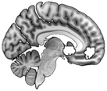
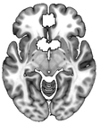
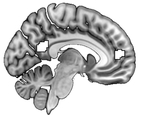
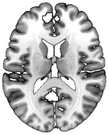
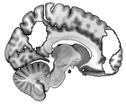
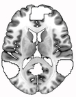

## Baek, Scholz, O'Donnell & Falk (2017). The Value of Sharing Information: A Neural Account of Information Transmission. _PsychScience_.

### Abstract

Humans routinely share information with others. What drives us to do so? We used neuroimaging to test an account of information selection and sharing that emphasizes inherent reward in self-reflection and connecting with others. Participants underwent fMRI while they considered personally reading and sharing _New York Times_ articles. Activity in hypothesized neural regions involved in positive valuation, self-related processing and taking the perspective of others was significantly associated with decisions to select and share articles, and scaled with preferences to do so. Activity in all three regions was greater when participants considered sharing with others versus selecting articles to read themselves. Findings suggest that people may consider value not only to self, but also to others even when selecting news articles to consume personally. Further, sharing heightens these pathways, in line with our proposed account of humans deriving value from self-reflection and connecting to others via sharing.

## Data

### ROI data

* To investigate the relationship between neural activity during the consideration of selecting and sharing news articles, we conducted a series of analyses using neural activity extracted from three sets of a priori regions-of-interest (ROIs) defined by three separate meta-analyses.

    1. Subjective value processing [VS + VMPFC] \(Bartra et al., 2013\)

    
    

    2. Self-related processing [MPFC + PCC] \(Murray et al., 2012\)

    
    

    3. Social cognition [VMPFC, MMPFC, DMPFC, PC/PCC, PC, bilateral TPJ, and rSTS] \(Dufour et al., 2013\). 

    
    

